# Пробный README в рамках обучения yandex practicum

## Самое крутое web-app на языке Java

Его крутость состоит в том, что его создал **Давид Белоцерковский**

### Основные функции 😂

Задачи приложения:

1. Сделать этот мир лучше.
2. Спасти человечество от голода.
3. Ноев ковчег 21 века.
4. ~~Повысить рождаемость населения~~

